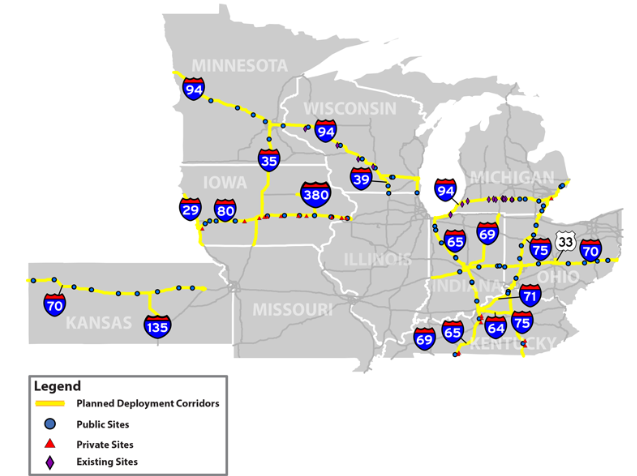
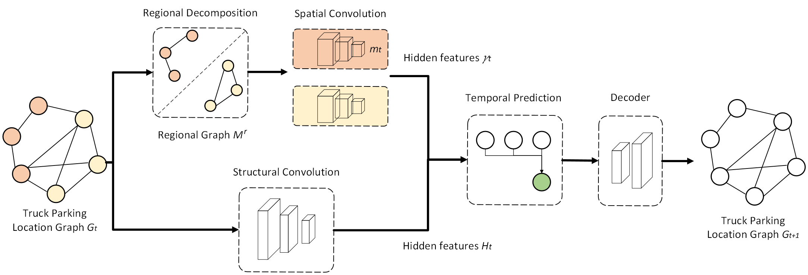
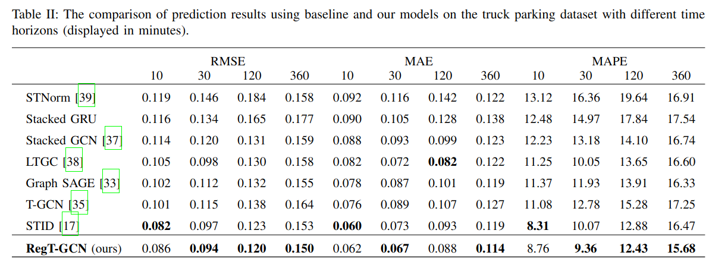

# RegT-GCN (Regional Temporal Graph Convolution Network)

<p align="center">
    
    
</p>


[Paper](https://arxiv.org/abs/2401.12920), [TPIMS Dataset](https://github.com/raynbowy23/TPIMSDataset), [Wis Transportal for mode data](https://transportal.cee.wisc.edu/tpims/)

## Abstract
Truck parking on freight corridors faces the major challenge of insufficient parking spaces. This is exacerbated by the Hour-of-Service (HOS) regulations, which often result in unauthorized parking practices, causing safety concerns. It has been shown that providing accurate parking usage prediction can be a cost-effective solution to reduce unsafe parking practices. In light of this, existing studies have developed various methods to predict the usage of a truck parking site and have demonstrated satisfactory accuracy. However, these studies focus on a single parking site, and few approaches have been proposed to predict the usage of multiple truck parking sites considering spatio-temporal dependencies, due to the lack of data. This paper aims to fill this gap and presents the Regional Temporal Graph Neural Network (RegT-GCN) to predict parking usage across the entire state to provide more comprehensive truck parking information. The framework leverages the topological structures of truck parking site locations and historical parking data to predict the occupancy rate considering spatio-temporal dependencies across a state. To achieve this, we introduce a Regional Decomposition approach, which effectively captures the geographical characteristics of the truck parking locations and their spatial correlations. Evaluation results demonstrate that the proposed model outperforms other baseline models, improving performance by more than 20%. 

## Requirements
To train and test the code, I use the followings:
- Ubuntu 22.04
- GeForce RTX 3080
- Cuda version 11.8


Set up Anaconda environment.
```
conda create -n regt-gcn Python=3.10
conda activate regt-gcn
```

Then setup Pytorch and Pytorch-Geometric. Note that pytorch-geometric-temporal hasn't been updated since 2022, torch-geometric needs to be compatible with the older version. Pyg-lib also supports until PyTorch 2.2.
```
pip install torch==2.1.0 torchvision==0.16.0 torchaudio==2.1.0 --index-url https://download.pytorch.org/whl/cu118

pip install torch_geometric

# Optional dependencies:
pip install pyg_lib torch_scatter torch_sparse torch_cluster torch_spline_conv -f https://data.pyg.org/whl/torch-2.1.0+cu118.html

pip install torch-geometric-temporal

pip install -r requirements.txt
```

**Issue**: If you meet the error saying `"ModuleNotFoundError: No module named 'torch_geometric.utils.to_dense_adj'"`, open the file `/home/{USER_NAME}/anaconda3/envs/regt-gcn/lib/python3.10/site-packages/torch_geometric_temporal/nn/attention/__init__.py"` and comment out the line `from .tsagcn import GraphAAGCN, AAGCN`. 


## Running Models

Please download `tpims_data_small.csv` from [TPIMS Dataset](https://github.com/raynbowy23/TPIMSDataset) and put it in `./dataset/data/`.

All you just need is to pick the model from scripts folder and run it! Our dataset is already pre-processed, so you just need to turn on `--preprocessed=True` in the running command.

We prepared pretrained model for RegT-GCN. If you want to use it for the inference, customize the configs and run `bash scripts/RegionalTemporalGCN_test.sh`.

Data building method is slightly different through models, so please specify the appropriate data loading method (`--dataloading_type`).

| Data Loading Type | Model Scripts
| :--- | :---
| 1    | A3TGCN.sh, GAT.sh, SpatialGCN.sh, StackedGRU.sh, GraphSAGE.sh
| 2    | RegionalTemporalGCN.sh, RandomTemporalGCN.sh, ConvStackedTemporalGCN.sh
| 3    | STID.sh, STNorm.sh, STAEformer.sh


Since our TPIMS format used in the paper is different from the traffic flow dataset format such as METR-LA, you can convert dataset format with `align_with_metr_format.py`.

If you want to explore more data, please download our raw dataset from [TPIMS Dataset](https://github.com/raynbowy23/TPIMSDataset).


## Results
This is the result table of benchmarks and our proposed RegT-GCN.

<p align="center">
    
</p>
<!-- 
<table>
    <thead>
        <tr>
            <th></th>
            <th colspan=4> RMSE </th>
            <th colspan=4> MAE </th>
            <th colspan=4> MAPE </th>
        </tr>
        <tr style="border-bottom:1px solid black">
            <td></td>
            <td>10</td>
            <td>30</td>
            <td>120</td>
            <td>360</td>
            <td>10</td>
            <td>30</td>
            <td>120</td>
            <td>360</td>
            <td>10</td>
            <td>30</td>
            <td>120</td>
            <td>360</td>
        </tr>
    </thead>
    <tbody>
        <tr>
            <td>ConvStackedTemporal GCN</td><td></td><td></td><td></td><td></td><td></td><td></td><td></td><td></td><td></td><td></td><td></td><td></td>
        </tr>
        <tr>
            <td>GAT</td><td></td><td></td><td></td><td></td><td></td><td></td><td></td><td></td><td></td><td></td><td></td><td></td>
        </tr>
        <tr>
            <td>STNorm</td><td>0.119</td><td>0.146</td><td>0.184</td><td>0.158</td><td>0.092</td><td>0.116</td><td>0.142</td><td>0.122</td><td>13.12</td><td>16.36</td><td>19.64</td><td>16.91</td>
        </tr>
        <tr>
            <td>Stacked GRU</td><td></td><td></td><td></td><td></td><td></td><td></td><td></td><td></td><td></td><td></td><td></td><td></td>
        </tr>
        <tr>
            <td>Stacked GCN</td><td></td><td></td><td></td><td></td><td></td><td></td><td></td><td></td><td></td><td></td><td></td><td></td>
        </tr>
        <tr>
            <td>LTGC</td><td></td><td></td><td></td><td></td><td></td><td></td><td></td><td></td><td></td><td></td><td></td><td></td>
        </tr>
        <tr>
            <td>Graph SAGE</td><td></td><td></td><td></td><td></td><td></td><td></td><td></td><td></td><td></td><td></td><td></td><td></td>
        </tr>
        <tr>
            <td>T-GCN</td><td></td><td></td><td></td><td></td><td></td><td></td><td></td><td></td><td></td><td></td><td></td><td></td>
        </tr>
        <tr style="border-bottom:1px solid black">
            <td>STID</td><td></td><td></td><td></td><td></td><td></td><td></td><td></td><td></td><td></td><td></td><td></td><td></td>
        </tr>
        <hr>
        <tr>
            <td>RanT-GCN</td><td></td><td></td><td></td><td></td><td></td><td></td><td></td><td></td><td></td><td></td><td></td><td></td>
        </tr>
        <tr>
            <td>RegT-GCN</td><td></td><td></td><td></td><td></td><td></td><td></td><td></td><td></td><td></td><td></td><td></td><td></td>
        </tr>
    </tbody>
</table> -->


## Citation

If you find our work useful in your research, please consider to cite followings.

TPIMS Dataset explanation:
```
@inproceedings{rei2023,
 author = {Tamaru, Rei and Cheng, Yang and Parker, Steven and Perry, Ernie and Ran, Bin and Ahn, Soyoung},
 title = {Web Portal Development and Site Usage Pattern Analysis for a Multi-State Truck Parking Information Management System (TPIMS)},
 booktitle = {International Conference on Transportation and Development 2023},
 chapter = {},
 year = {2023},
 pages = {489-500},
 doi = {10.1061/9780784484876.043},
}

```

Truck parking usage prediction:
```
@article{tamaru2024truck,
    title={Truck Parking Usage Prediction with Decomposed Graph Neural Networks},
    author={Tamaru, Rei and Cheng, Yang and Parker, Steven and Perry, Ernie and Ran, Bin and Ahn, Soyoung},
    journal={arXiv preprint arXiv:2401.12920},
    year={2024}
}

```

## Contact 
If you want to access to the Truck Parking Query Archive, please contact to transportal@topslab.wisc.edu. For questions or comments about papers, codes, and web site, please reach out to tamaru@wisc.edu.
